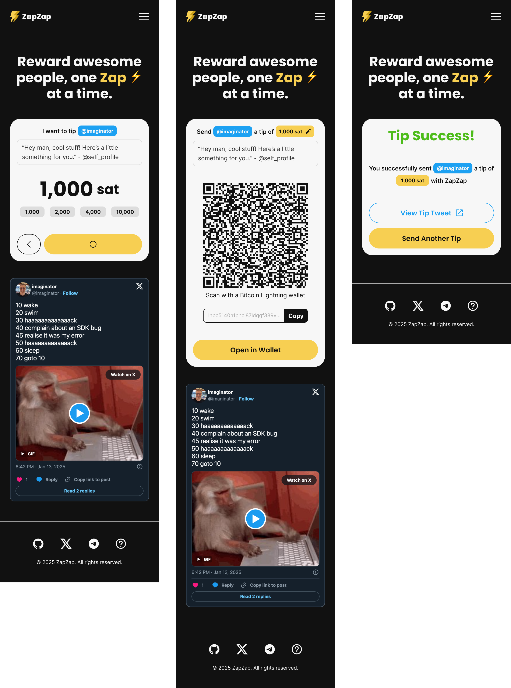
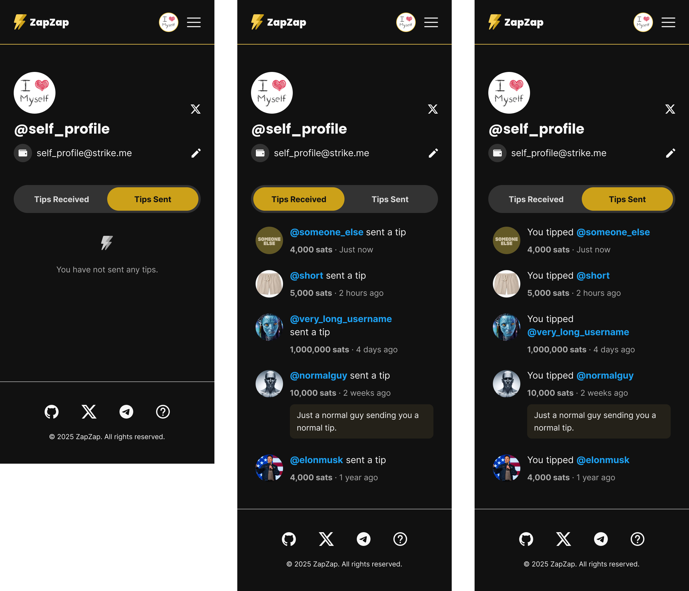

# ZapZap tipping webapp

Paste a tweet URL ➡️ pay the invoice ➡️ they are notified ➡️ tips are instantly sent to their wallet!

## Running on Firebase

Install [Firebase CLI](https://firebase.google.com/docs/cli)

## deployment


```bash
firebase login
firebase deploy
```

Deploys to:
- https://beta.zap-zap.me

View the [Firebase Console](https://console.firebase.google.com/u/0/project/zapzap-me/hosting/sites/beta-zap-zap-me) for status


### Using Docker to just run the frontend

```bash 
docker build -t zapzap-web -f Dockerfile
docker run -p 4200:4200  -v .:/src zapzap-web # live editing
```





# License

    Copyright 2025 ZapZap Heavy Industries

    Licensed under the Apache License, Version 2.0 (the "License");
    you may not use this file except in compliance with the License.
    You may obtain a copy of the License at

       http://www.apache.org/licenses/LICENSE-2.0

    Unless required by applicable law or agreed to in writing, software
    distributed under the License is distributed on an "AS IS" BASIS,
    WITHOUT WARRANTIES OR CONDITIONS OF ANY KIND, either express or implied.
    See the License for the specific language governing permissions and
    limitations under the License.

